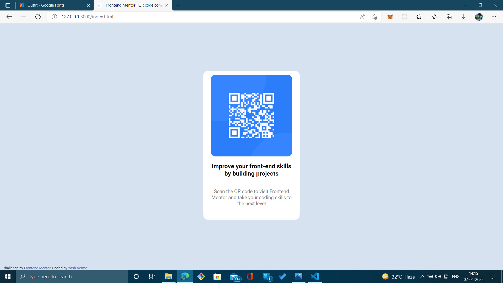

# Frontend Mentor - QR code component solution

This is a solution to the [QR code component challenge on Frontend Mentor](https://www.frontendmentor.io/challenges/qr-code-component-iux_sIO_H). Frontend Mentor challenges help you improve your coding skills by building realistic projects. 

## Table of contents

- [Overview](#overview)
  - [Screenshot](#screenshot)
  - [Links](#links)
- [My process](#my-process)
  - [Built with](#built-with)
- [Author](#author)

## Overview

### Screenshot

### Links

- Solution URL: [Solution](https://github.com/yash1699/qr-code-component-main/)
- Live Site URL: [Live site](https://yash1699.github.io/qr-code-component-main/)

## My process

### Built with

- HTML5 markup
- CSS custom properties
- Flexbox

## Author

- Frontend Mentor - [@yash1699](https://www.frontendmentor.io/profile/yash1699)
- GitHub - [@yash1699](https://github.com/yash1699)
- LinkedIn - [@yash-verma-5a84641a9](https://linkedin.com/in/yash-verma-5a84641a9)
